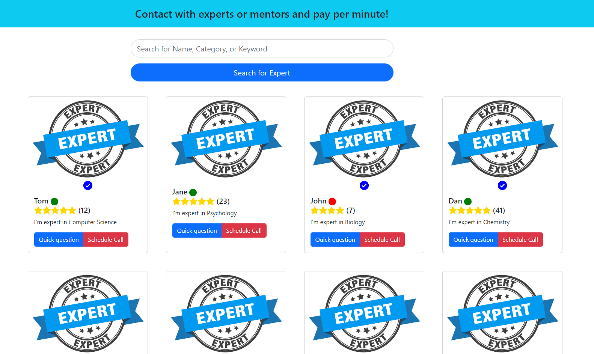

# Welcome to Tylkozapytam
 
Tylkozapytam.pl is a simple, yet powerful, question and answer system. Hire experts per minute or just ask a question. 

- Application deployment is done with Nginx, Gunicorn  and HTTPS on AWS EC2.
- Swagger documentation is available at [tylkozapytam.pl](https://tylkozapytam.pl/docs/), for safety reasons options to create account or login are turned off.

Application is still in development, so there are more features to come.

Next steps:
- User dashboard, profile, settings
- Mailing system
- Notifications system
- Payments system
- Queues and tasks system
- More React implementations and React deployment
- More tests (unit, integration, e2e)
- Documentation update
- More CI/CD(tests, deployment)
- Docker, docker-compose for services within the application

To get started check out the [documentation](docs/README.md).

## Frontend screenshot
